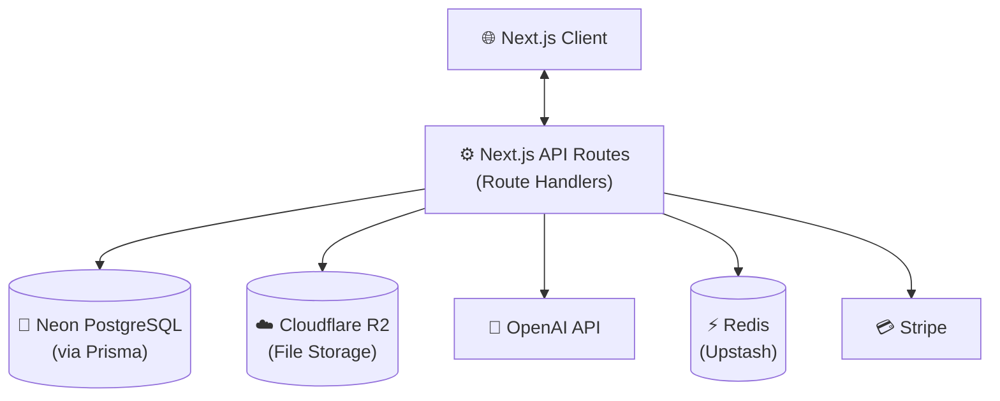
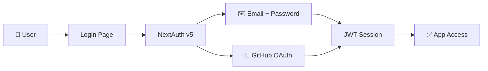
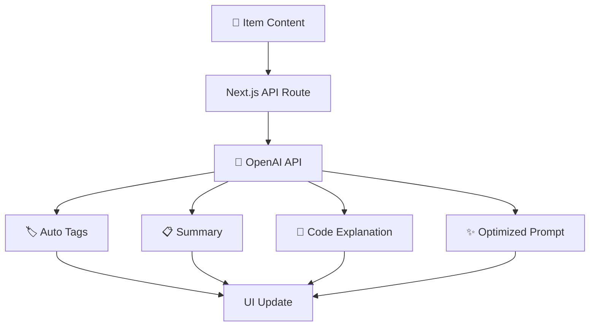

# 🗃️ DevStack — Project Overview

> **Store Smarter. Build Faster.**
> A centralized, AI-enhanced knowledge hub for developers — snippets, prompts, commands, notes, files, and more in one searchable place.

---

## 📌 The Problem

Developers scatter their essential knowledge across a dozen tools:

| Where it lives now | What ends up there  |
| ------------------ | ------------------- |
| VS Code / Notion   | Code snippets       |
| AI chat history    | Prompts & workflows |
| Project folders    | Context files       |
| Browser bookmarks  | Useful links        |
| Random folders     | Docs & references   |
| `.txt` files       | Terminal commands   |
| GitHub Gists       | Project templates   |
| Bash history       | CLI one-liners      |

The result: **context switching, lost knowledge, and inconsistent workflows.**

➡️ devstack provides **one searchable, AI-powered hub** for everything a developer needs to build.

---

## 🧑‍💻 Target Users

| Persona                       | Core Need                                                |
| ----------------------------- | -------------------------------------------------------- |
| 🧑‍💻 Everyday Developer         | Quick access to snippets, commands, and links            |
| 🤖 AI-First Developer         | Store and optimize prompts, workflows, and context files |
| 🎓 Content Creator / Educator | Reusable code samples and course notes                   |
| 🏗️ Full-Stack Builder         | Patterns, boilerplates, and API references               |

---

## ✨ Core Features

### A) Items & Item Types

Every saved resource is an **Item**. Built-in system types:

| Type    | Icon  | Use Case                           |
| ------- | ----- | ---------------------------------- |
| Snippet | `</>` | Code fragments in any language     |
| Prompt  | `🤖`  | AI prompts and system instructions |
| Note    | `📝`  | Markdown notes and documentation   |
| Command | `$_`  | CLI commands and shell scripts     |
| File    | `📎`  | Uploaded templates, docs, configs  |
| Image   | `🖼️`  | Screenshots, diagrams, assets      |
| URL     | `🔗`  | Bookmarked links with descriptions |

> Pro users can create **custom item types** with their own icon and color.

---

### B) Collections

Group related items of any type into named collections:

- `React Patterns`
- `Context Files`
- `Python Snippets`
- `Deployment Commands`

Collections support favorites and can hold mixed item types.

---

### C) Search

Full-text search across all item fields:

- **Title** — exact and fuzzy match
- **Content** — full-text indexed
- **Tags** — filter by one or multiple
- **Type** — filter to specific item types

---

### D) Authentication

- ✉️ Email + Password
- 🐙 GitHub OAuth

Powered by [NextAuth v5 (Auth.js)](https://authjs.dev/).

---

### E) Additional Features

- ⭐ Favorites & 📌 pinned items
- 🕐 Recently used / viewed
- 📥 Import from files
- ✍️ Markdown editor for text items
- 📁 File uploads (images, docs, templates)
- 📤 Export as JSON or ZIP
- 🌙 Dark mode (default)

---

### F) AI Superpowers _(Pro only)_

| Feature             | Description                                  |
| ------------------- | -------------------------------------------- |
| 🏷️ Auto-tagging     | Suggests relevant tags based on item content |
| 📋 AI Summary       | One-line summary generated for any item      |
| 🧠 Explain Code     | Plain-English explanation of code snippets   |
| ✨ Prompt Optimizer | Rewrites and strengthens AI prompts          |

> Powered by **OpenAI** — model: `gpt-4o-mini` (configurable)

---

## 🧱 Tech Stack

| Category     | Choice                      | Link                                                                 |
| ------------ | --------------------------- | -------------------------------------------------------------------- |
| Framework    | Next.js 15 (React 19)       | [nextjs.org](https://nextjs.org)                                     |
| Language     | TypeScript                  | [typescriptlang.org](https://www.typescriptlang.org)                 |
| Database     | Neon PostgreSQL             | [neon.tech](https://neon.tech)                                       |
| ORM          | Prisma                      | [prisma.io](https://www.prisma.io)                                   |
| Caching      | Redis (Upstash)             | [upstash.com](https://upstash.com)                                   |
| File Storage | Cloudflare R2               | [developers.cloudflare.com/r2](https://developers.cloudflare.com/r2) |
| CSS / UI     | Tailwind CSS v4 + shadcn/ui | [ui.shadcn.com](https://ui.shadcn.com)                               |
| Auth         | NextAuth v5 (Auth.js)       | [authjs.dev](https://authjs.dev)                                     |
| AI           | OpenAI API                  | [platform.openai.com](https://platform.openai.com)                   |
| Payments     | Stripe                      | [stripe.com](https://stripe.com)                                     |
| Deployment   | Vercel                      | [vercel.com](https://vercel.com)                                     |
| Monitoring   | Sentry                      | [sentry.io](https://sentry.io)                                       |

---

## 🗄️ Data Model

> This schema is a **starting point** and will evolve through development.

```prisma
datasource db {
  provider = "postgresql"
  url      = env("DATABASE_URL")
}

generator client {
  provider = "prisma-client-js"
}

model User {
  id                   String       @id @default(cuid())
  email                String       @unique
  password             String?
  name                 String?
  image                String?
  isPro                Boolean      @default(false)
  stripeCustomerId     String?      @unique
  stripeSubscriptionId String?      @unique
  items                Item[]
  itemTypes            ItemType[]
  collections          Collection[]
  tags                 Tag[]
  createdAt            DateTime     @default(now())
  updatedAt            DateTime     @updatedAt
}

model Item {
  id           String      @id @default(cuid())
  title        String
  contentType  String      // "text" | "file"
  content      String?     // used for text-based types
  fileUrl      String?
  fileName     String?
  fileSize     Int?
  url          String?
  description  String?
  isFavorite   Boolean     @default(false)
  isPinned     Boolean     @default(false)
  language     String?     // for code snippets (e.g. "typescript")
  userId       String
  user         User        @relation(fields: [userId], references: [id], onDelete: Cascade)
  typeId       String
  type         ItemType    @relation(fields: [typeId], references: [id])
  collectionId String?
  collection   Collection? @relation(fields: [collectionId], references: [id], onDelete: SetNull)
  tags         ItemTag[]
  createdAt    DateTime    @default(now())
  updatedAt    DateTime    @updatedAt

  @@index([userId])
  @@index([typeId])
  @@index([collectionId])
}

model ItemType {
  id       String  @id @default(cuid())
  name     String
  icon     String?
  color    String?
  isSystem Boolean @default(false) // true = built-in, false = user-created
  userId   String?
  user     User?   @relation(fields: [userId], references: [id], onDelete: Cascade)
  items    Item[]

  @@unique([name, userId]) // prevent duplicate custom types per user
}

model Collection {
  id          String   @id @default(cuid())
  name        String
  description String?
  isFavorite  Boolean  @default(false)
  userId      String
  user        User     @relation(fields: [userId], references: [id], onDelete: Cascade)
  items       Item[]
  createdAt   DateTime @default(now())
  updatedAt   DateTime @updatedAt

  @@index([userId])
}

model Tag {
  id     String    @id @default(cuid())
  name   String
  userId String
  user   User      @relation(fields: [userId], references: [id], onDelete: Cascade)
  items  ItemTag[]

  @@unique([name, userId]) // tags are unique per user
  @@index([userId])
}

model ItemTag {
  itemId String
  tagId  String
  item   Item   @relation(fields: [itemId], references: [id], onDelete: Cascade)
  tag    Tag    @relation(fields: [tagId], references: [id], onDelete: Cascade)

  @@id([itemId, tagId])
}
```

---

## 🔌 API Architecture



---

## 🔐 Auth Flow



---

## 🧠 AI Feature Flow



---

## 💰 Monetization

| Plan    | Price           | Item Limit | Collections | AI Features | File Uploads | Custom Types | Export      |
| ------- | --------------- | ---------- | ----------- | ----------- | ------------ | ------------ | ----------- |
| 🆓 Free | $0              | 50 items   | 3           | ❌          | Images only  | ❌           | ❌          |
| ⭐ Pro  | $8/mo or $72/yr | Unlimited  | Unlimited   | ✅          | All types    | ✅           | ✅ JSON/ZIP |

Payments handled via **[Stripe](https://stripe.com)** with webhook sync for subscription state.

---

## 🎨 UI / UX

- 🌙 **Dark mode first** — light mode as a toggle
- Minimal, keyboard-friendly, developer-centric design
- Syntax highlighting for all code snippets ([Shiki](https://shiki.matsu.io/) or [Prism.js](https://prismjs.com/))
- Inspired by **Notion**, **Linear**, and **Raycast**

### Layout

```
┌─────────────────────────────────────────────────────────┐
│  devstack                              🔍  [Search...]  │
├──────────────┬──────────────────────────────────────────┤
│  📌 Pinned   │                                          │
│  ⭐ Favorites│     Item Grid / List (main workspace)    │
│  🕐 Recent   │                                          │
│  ─────────── │     ┌──────┐ ┌──────┐ ┌──────┐         │
│  Collections │     │ Item │ │ Item │ │ Item │         │
│  › React     │     └──────┘ └──────┘ └──────┘         │
│  › Python    │                                          │
│  › Commands  │                                          │
│  ─────────── │                                          │
│  Types       │                                          │
│  Snippet     │                                          │
│  Prompt      │                                          │
│  Note        │                                          │
│  [+ New]     │                                          │
└──────────────┴──────────────────────────────────────────┘
```

- **Collapsible sidebar** — filters, collections, item types
- **Full-screen item editor** — with markdown preview and code highlighting
- **Mobile**: sidebar becomes a slide-in drawer; touch-optimized controls

---

## 🗂️ Development Workflow

- **One Git branch per lesson** so students can follow along and diff changes
- AI-assisted coding with **Cursor**, **Claude**, or **ChatGPT**
- **Sentry** for runtime error tracking from day one
- **GitHub Actions** for optional CI (lint, type-check, test)

```bash
# Branch naming convention
git switch -c lesson-01-project-setup
git switch -c lesson-02-auth
git switch -c lesson-03-items-crud
git switch -c lesson-04-collections
git switch -c lesson-05-search
git switch -c lesson-06-ai-features
git switch -c lesson-07-billing
```

---

## 🔑 Environment Variables

```bash
# Database
DATABASE_URL="postgresql://..."

# Auth
NEXTAUTH_SECRET="..."
NEXTAUTH_URL="http://localhost:3000"
GITHUB_CLIENT_ID="..."
GITHUB_CLIENT_SECRET="..."

# File Storage (Cloudflare R2)
R2_ACCOUNT_ID="..."
R2_ACCESS_KEY_ID="..."
R2_SECRET_ACCESS_KEY="..."
R2_BUCKET_NAME="devstack"
R2_PUBLIC_URL="https://..."

# AI
OPENAI_API_KEY="..."

# Payments
STRIPE_SECRET_KEY="..."
STRIPE_WEBHOOK_SECRET="..."
NEXT_PUBLIC_STRIPE_PUBLISHABLE_KEY="..."

# Cache (optional)
UPSTASH_REDIS_REST_URL="..."
UPSTASH_REDIS_REST_TOKEN="..."

# Monitoring
NEXT_PUBLIC_SENTRY_DSN="..."
```

---

## 🧭 Roadmap

### 🏁 MVP

- [ ] Project setup (Next.js, Prisma, NextAuth, Tailwind + shadcn)
- [ ] Auth — email/password + GitHub OAuth
- [ ] Items CRUD (text-based types)
- [ ] Collections CRUD
- [ ] Tagging system
- [ ] Full-text search
- [ ] Favorites & pinned items
- [ ] Free tier limits (50 items, 3 collections)
- [ ] Dark mode UI

### ⭐ Pro Phase

- [ ] Stripe billing + upgrade flow
- [ ] AI features (auto-tag, summarize, explain, optimize)
- [ ] File uploads via Cloudflare R2
- [ ] Custom item types
- [ ] Export (JSON / ZIP)
- [ ] Markdown editor with preview
- [ ] Syntax highlighting

### 🔮 Future Enhancements

- [ ] Shared / public collections
- [ ] Team & Org plans
- [ ] VS Code extension
- [ ] Browser extension (save from anywhere)
- [ ] Public REST API + CLI tool
- [ ] Redis caching layer
- [ ] Full Sentry integration

---

## 📌 Current Status

> **In planning** — environment setup and UI scaffolding next.

---

_🏗️ devstack — Store Smarter. Build Faster._
